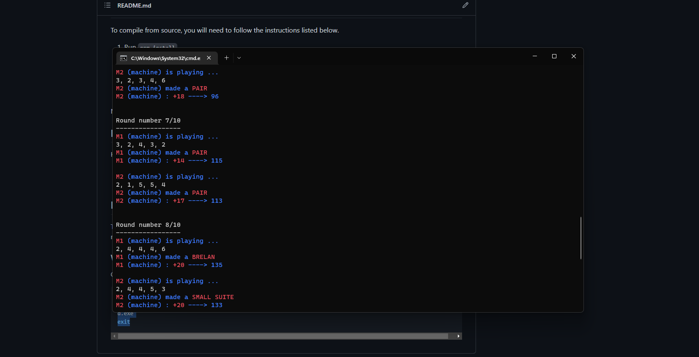

# Yams
Simple yams game reproduction made for a NSI project.

This game is developed in Python by Antoine Bartoli and Hugo LeGlaunec without using any external libraries.



## How to play
The game can be played versus real players or versus bots.

### Play with Python
1) Install Python.
2) Run `Python Yams.py`.

### Play with a compiled version (Recommended)
1) Grab a compiled version.
2) Run `Yams.exe`.

## Compile using Auto PY to EXE
The game can be compiled using Auto PY to EXE, see the tutorial [here]("https://pypi.org/project/auto-py-to-exe/")

1) Install [PyInstaller](https://pyinstaller.org/en/stable/).
2) Run `pyinstaller --noconfirm --onedir --console --add-data "./src"`.

## Install from command line
Really usefull for people who don't want to search for the right download link ...

### Windows
Copy and paste the commands in a cmd on a machine.

```bash
cd %TEMP%
powershell wget "https://github.com/AntoineBRTL/Yams/releases/download/1.0/yams.zip" 
exit
```